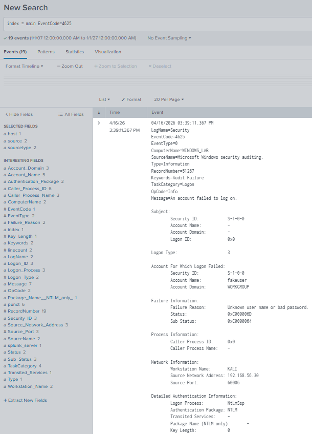
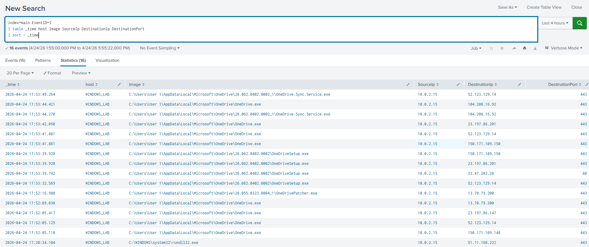

# Cybersecurity Labs

This repository contains hands-on cybersecurity labs focused on SOC analysis, log investigation, and incident detection

## Lab Environment
- VirtualBox-based lab environment

### Network
- Host-only network (192.168.56.0/24)

### Systems
- Ubuntu Splunk server, log analysis (192.168.56.10/24)
- Windows client with Sysmon + Forwarder, log source (192.168.56.20/24)
- Kali Linux, attack simulation (192.168.56.30/24)

### Tool Used
- Splunk Enterprise
- Sysmon
- VirtualBox

---

## Completed Labs

### Splunk Failed Login Detection Lab
Detect brute-force login attempts using Windows Event Logs (Event ID 4625)

[View Lab](.splunk-failed-logins-lab)

### Sysmon Network Analysis
Detection of port scanning activity using Sysmon and Splunk

[View Lab](.sysmon-network-analysis)

---

## Skills Demonstrated

- Log ingestion and normalization (Splunk, Sysmon)
- SPL query writing
- Security event analysis
- Basic threat detection (brute-force attacks)
- Lab environment setup and documentation
- Identifying patterns indicative of malicious behavior
- Simulated attack scenarios (nmap reconnaissance)
- Detection development using aggregation and filtering
- Network traffic analysis (Sysmon Event ID 3)
