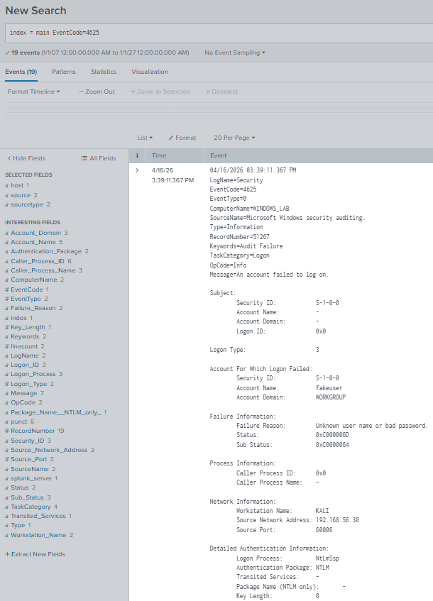
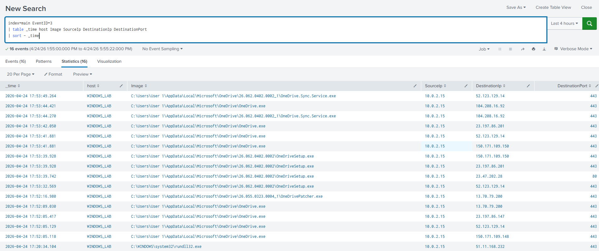
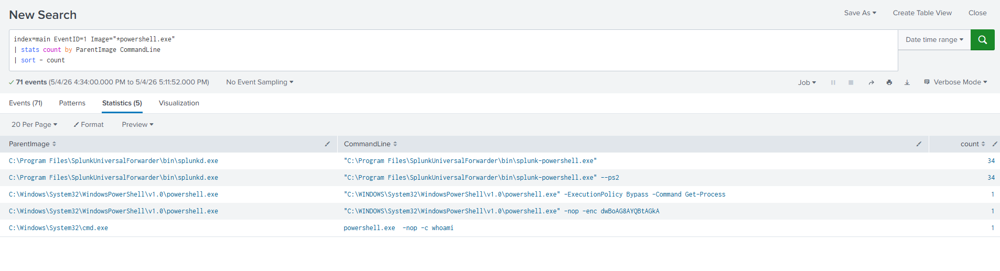

# Cybersecurity Labs

This repository demonstrates hands-on cybersecurity skills through simulated attack scenarios and log-based detection using Splunk and Sysmon.

## Lab Environment
- Custom-built virtual lab environment for controlled attack simulation and log analysis
- VirtualBox-based lab environment

### Network
- Host-only network (192.168.56.0/24)

### Systems
- Ubuntu Splunk server (log analysis platform) - 192.168.56.10
- Windows client with Sysmon + Forwarder (log source) - 192.168.56.20
- Kali Linux (attack simulation) - 192.168.56.30

### Tools Used
- Splunk Enterprise
- Sysmon
- VirtualBox

---

## Completed Labs

### Splunk Failed Login Detection
Detects brute-force login attempts using Windows Event Logs (Event ID 4625)

[View Lab](./splunk-failed-logins-lab)

### Sysmon Network Analysis
Detects port scanning activity using Sysmon Event ID 3 and Splunk

[View Lab](./sysmon-network-analysis-lab)

### PowerShell Process Investigation
Detects suspicious PowerShell execution using Sysmon Event ID 1 and command-line analysis

[View Lab](./powershell-process-investigation-lab)

---

## Skills Demonstrated

- Log ingestion and normalization (Splunk, Sysmon)
- SPL query development
- Identifying patterns indicative of malicious behavior
- Simulated attack scenarios (nmap reconnaissance, PowerShell abuse)
- Detection development using aggregation and filtering
- Process and network traffic analysis (Sysmon Event IDs 1 and 3)
- Detection of common attack techniques (brute-force, reconnaissance, obfuscation)
- Lab environment setup and documentation
