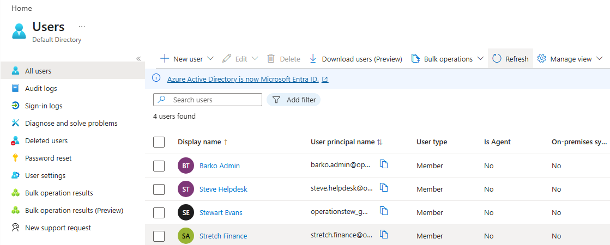
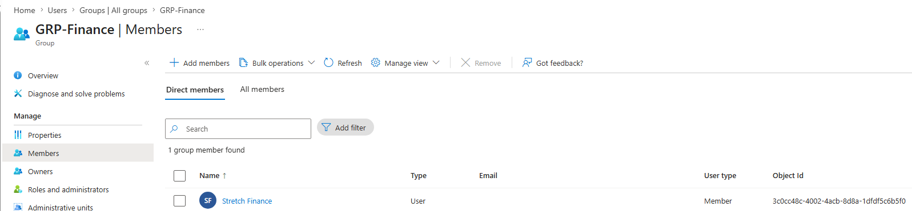
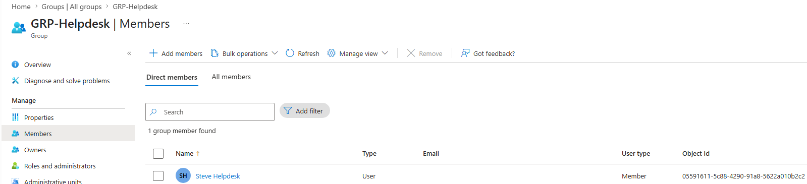
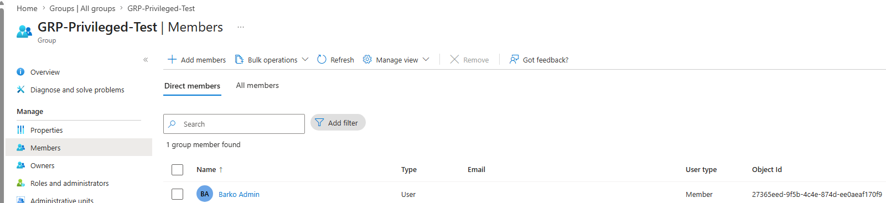
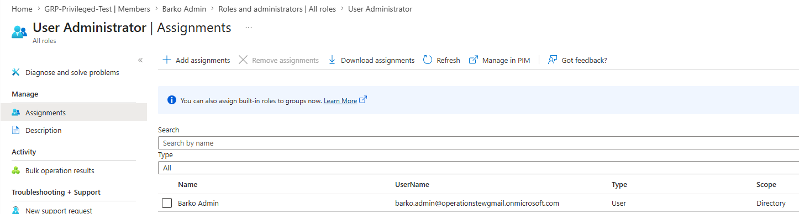
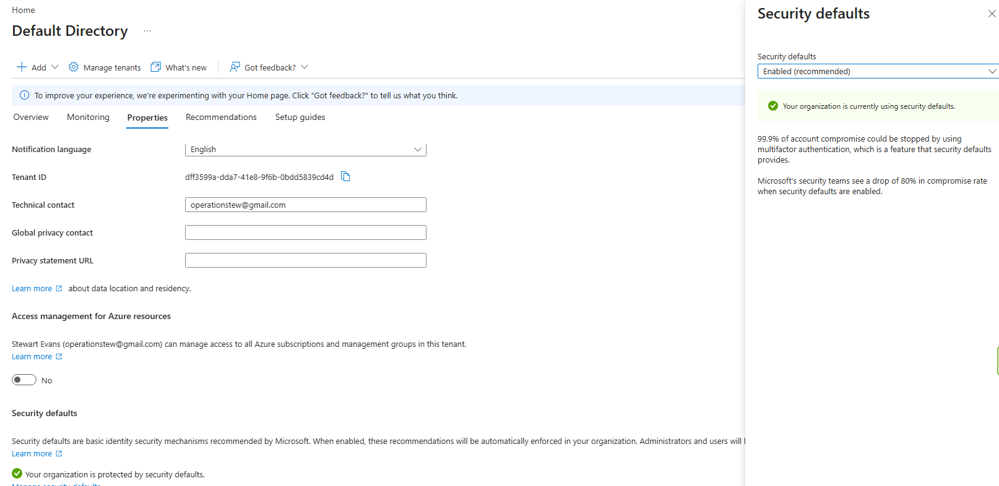
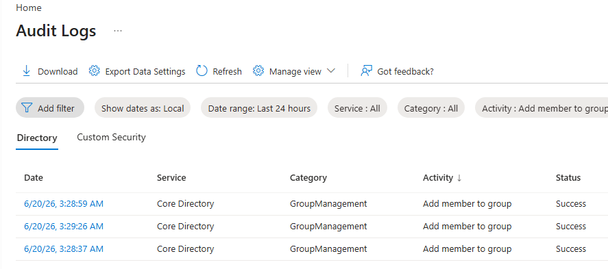

# Entra ID Identity Lab

## Objective

- Configure a Microsoft Entra ID tenant
- Create and manage user accounts
- Implement role-based access control (RBAC)
- Organize users using security groups
- Review sign-in and audit logs
- Demonstrate core identity and access management (IAM) concepts

---

## Environment

### Client System
- Windows 11 Client (WINDOWS_LAB)

### Platform
- Microsoft Entra ID

---

## Configuration

- Created the following users
	- Barko Admin
	- Steve Helpdesk
	- Stretch Finance

- Created the following groups to represent various business functions and assigned the following users to them accordingly. This demonstrates group-based access management and user organization within Microsoft Entra ID
	- GRP-Privileged-Test
		- Barko Admin
	- GRP-Helpdesk
		- Steve Helpdesk
	- GRP-Finance
		- Stretch Finance

- Assigned Barko the User Administrator role to demonstrate role-based access control (RBAC) and least-privilege administration without granting him full Global Administrator privileges.

## Sign-In Log Review

- Generated both successful and failed sign-in events using multiple test accounts.
- Reviewed Entra sign-in logs to verify authentication status, timestamps, and user activity.
- Security Defaults required MFA registration during sign-in, demonstrating Microsoft's baseline identity protection controls.

## Audit Log Review

- Reviewed the audit logs to verify administrative actions within the tenant. 
- Observed successful group membership assignments and user management actions.
- Confirmed that Entra records identity and access management changes for auditing and investigation purposes.

---

## Key Takeaways

- Practiced core identity and access management (IAM) tasks within Microsoft Entra ID.
- Created and managed user accounts and security groups.
- Applied role-based access control using a limited administrative role.
- Enabled Security Defaults to strengthen tenant security and enforce MFA registration
- Generated and investigated authentication events using Entra sign-in logs.
- Reviewed audit logs to track administrative changes and group membership activity.
- Developed familiarity with Entra administration workflows used in enterprise environments.

---

## Screenshots

