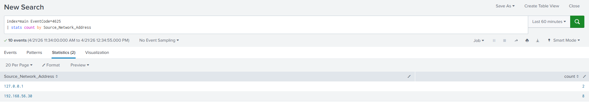
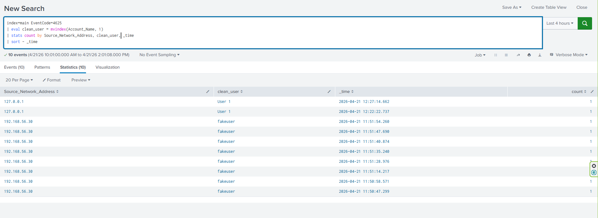

# Splunk Failed Login Detection Lab

## Objective

- Detect repeated failed authentication attempts (Event ID 4625) using Splunk
- Ingest and analyze Windows Security logs from a forwarder
- Identify brute-force or unauthorized access attempts based on frequency and source patterns

---

## Environment

### Network
- Host-only network (192.168.56.0/24)

### Systems
- Ubuntu Server (Splunk Enterprise): 192.168.56.10
- Windows 11 Client (WINDOWS_LAB, log source): 192.168.56.20
- Kali Linux (attacker simulation): 192.168.56.30


### Software
- Splunk Enterprise (log analysis platform)
- Splunk Universal Forwarder (log forwarding to Splunk on port 9997)
- Sysmon (enhanced Windows event logging)

Remote access methods:
- Commands: ssh occulydian@127.0.0.1 -p 2222
- Protocol: SSH (TCP 2222)
- Authentication: username/password

Splunk Access:
- Web interface: http://127.0.0.1:8000
- Backend server IP: 192.168.56.10
- Access method: Localhost port forwarding / loopback interface
- Protocol: HTTP

---

## Data Collection

- Configured Splunk Universal Forwarder on Windows client to send logs to Splunk server
- Enabled Windows Security event logging and Sysmon
- Verified Splunk log ingestion using `index=main`
- Confirmed Windows Security logs from host 192.168.56.20

- Observed that Sysmon logs were initially ingested as raw XML and required normalization for structured field extraction

- Generated failed login attempts using invalid credentials
- Approximately 10 attempts were performed in rapid succession to simulate brute-force behavior
- Simulated both malicious and benign failed login activity:
	- Rapid failed attempts from Kali Linux to emulate brute-force behavior
	- Occasional local failed logins to represent normal user error
- Verified that EventCode 4625 logs were successfully ingested and searchable in Splunk

---

## Detection Query

### Query

```spl
index=main EventCode=4625
| stats count by Source_Network_Address, Account_Name
| sort - count
```

- Identifies failed login attempts (EventCode 4625)
- Groups events by source IP and account to detect repeated attempts and their source
- Highlights high-frequency authentication failures that can indicate brute-force activity

---

### Key Indicators

- EventCode 4625 -> Failed login attempt
- Source_Network_Address -> Origin of authentication attempt
- Account_Name -> Target user account
- _time -> Timestamp used to correlate authentication activity

---

### Log Normalization

- Installed Splunk Add-on for Microsoft Sysmon on both forwarder and search head
- Parsed Sysmon XML logs into structured fields (Image, CommandLine, ParentImage, etc.)
- Reduced reliance on manual regex field extraction
- Converted raw Sysmon XML logs into searchable fields for easier querying in Splunk

---

## Findings

- Approximately ten failed login attempts were generated during testing
- Eight failed login attempts were observed from a single source IP (192.168.56.30), corresponding to the Kali machine
- The frequency and clustering of the detected events were consistent with brute-force behavior
- Two login attempts that originated locally (127.0.0.1) were also present but at a lower frequency and clustering, consistent with normal behavior
- Aggregation by source IP and username helped distinguish attacker activity from normal user behavior

---

## Screenshots





---

## Key Takeaways

- Demonstrated the ability to ingest and analyze Windows Security logs in Splunk
- Built detection logic for identifying brute-force login attempts using statistical aggregation
- Differentiated between malicious and benign authentication failures based on frequency, source, and clustering
- Installed and enabled the Splunk Sysmon add-on to parse Sysmon logs into structured fields
- Established a repeatable workflow for analyzing authentication events in Splunk

### Next Steps
- Further investigation could include correlating failed logins (4625) with successful logins (4624) to identify potential compromise