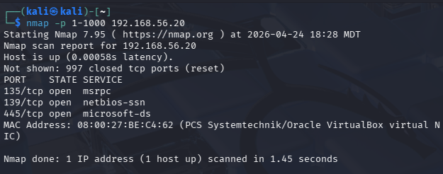
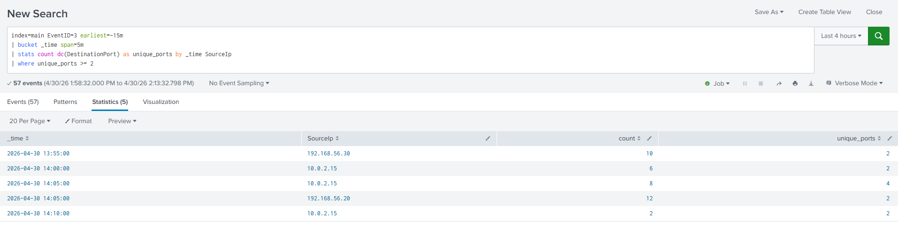
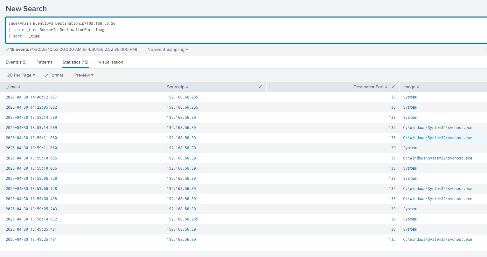

# Sysmon Network Analysis Lab

## Objective

- Analyze Sysmon Event ID 3 logs in Splunk to examine network connections
- Identify key fields from logs for network analysis
- Detect and investigate patterns indicative of reconnaissance


---

## Environment

### Network

- Host-only network (192.168.56.0/24)

### Systems

- Ubuntu Server (Splunk Enterprise): 192.168.56.10
- Windows 11 Client (WINDOWS_LAB, log source): 192.168.56.20
- Kali Linux (attacker simulation): 192.168.56.30


### Software

- Splunk Enterprise (log analysis platform)
- Splunk Universal Forwarder (log forwarding to Splunk on port 9997)
- Sysmon (enhanced Windows event logging)

Remote access methods:
- Commands: ssh occulydian@127.0.0.1 -p 2222
- Protocol: SSH (TCP 2222)
- Authentication: username/password

Splunk Access:
- Web interface: http://127.0.0.1:8000
- Backend server IP: 192.168.56.10
- Access method: Localhost port forwarding / loopback interface
- Protocol: HTTP

---

## Data Collection

Used the query
```spl
index=main EventID=3
| table _time host Image SourceIp DestinationIp DestinationPort
| sort - _time
```
- Confirmed that Sysmon Event ID 3 (Network Connection) logs are successfully being ingested into Splunk
- Identified key fields for analysis:
	- Image (process initiating the connection)
	- SourceIp
	- DestinationIp
	- Destination Port
- Observed multiple outbound connections from the Windows host, primarily over port 443

- Generated network traffic from the Kali Linux VM to simulate reconnaissance activity
```bash
nmap -p 1-1000 192.168.56.20
```
- Source: Kali VM (192.168.56.30)
- Destination: Windows VM (192.168.56.20)

- Additional filtering was required to isolate traffic generated by the nmap scan

---

### Detection Queries

- After correcting the Sysmon NetworkConnect configuration, Event ID 3 logs captured traffic from the Kali host. Aggregation over a 5-minute window was used to identify scan-like behavior based on repeated connections and multiple destination ports.

```spl
index=main EventID=3 earliest=-15m
| bucket _time span=5m
| stats count dc(DestinationPort) as unique_ports by _time SourceIp
| where unique_ports >= 2
```

- This query groups Sysmon network connection events into 5-minute windows and identifies source IPs connecting to multiple destination ports. The Kali host generated repeated connections to multiple ports, which were detected in Splunk. This behavior is consistent with reconnaissance activity such as port scanning.

```spl
index=main EventID=3 SourceIp=192.168.56.30
| stats count dc(DestinationPort) as unique_ports values(DestinationPort) as ports by SourceIp DestinationIp
| where unique_ports >= 2
| sort - unique_ports
```

- Port scans performed on the Kali machine, generating multiple events.
- A low threshold was used because the lab generated a limited amount of logged Sysmon network connection events. The goal was to demonstrate scan-pattern detection logic.
- Internal NAT traffic (10.0.2.x) was excluded to reduce noise and highlight deliberate activity.

```spl
index=main EventID=3
| bin _time span=1m
| stats count dc(DestinationPort) as unique_ports by _time SourceIp
| where unique_ports >= 2 AND count >= 5
| search NOT SourceIp=10.0.2.*
| sort - _time
```

- Added a time-based query to detect bursts of activity

---

### Key Indicators

- High number of unique destination ports from a single source IP
- Multiple connection attempts within a short time window
- Consistent source IP targeting the same destination IP


---

## Findings

- Multiple network connections were observed originating from the Kali Linux host (192.168.56.30)  
- The source IP connected to multiple destination ports on the Windows host (192.168.56.20) within a short time window  
- This behavior is consistent with port scanning activity generated by the nmap command  

- Filtering the results to the target system made the pattern more apparent, showing repeated connections from a single source IP to multiple ports  
- The detection query successfully identified scan-like behavior using a threshold based on unique destination ports

---

## Screenshots






---

## Key Takeaways

- Sysmon Event ID 3 provides detailed visibility into network connections at the host level
- Splunk can be used to identify patterns such as port scanning through aggregation and filtering
- Distinguishing between normal and abnormal traffic is critical for effective analysis
- Simple queries can be used to detect reconnaissance behavior


### Next Steps

- Expand detection logic by tuning thresholds based on observed behavior
- Incorporate additional Sysmon events (Event ID 1) to correlate Network activity with process execution
- Improve filtering to better distinguish internal traffic from external connections
- Test additional reconnaissance techniques (such as different nmap scan types) to observe variations in log data
